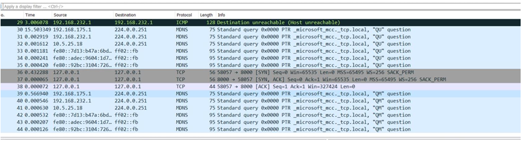
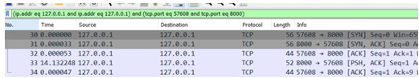

# Multiplayer Tic Tac Toe using Socket Programming

## Overview

This project implements a multiplayer Tic Tac Toe game using Python socket programming.

The application follows a client-server architecture where one player acts as the server and another connects as a client.

The GUI is built using Tkinter and threading is used for handling simultaneous network communication.

## Features

- Multiplayer game over TCP sockets
- GUI built with Tkinter
- Client-server architecture
- Multithreading for network communication
- Packet analysis using Wireshark

## Technologies Used

- Python
- Socket Programming
- Tkinter
- Threading
- Wireshark

## Architecture

The system follows a **client-server architecture**.

- Player 1 acts as the **server**
- Player 2 acts as the **client**
- Communication occurs using **TCP sockets**
- The server listens on **port 8000**
- Moves are transmitted as messages between players

The GUI is implemented using **Tkinter**, and **threading** allows the server to handle communication while updating the interface.

## Project Structure

```
tic-tac-toe-socket-game
│
├── src
│   ├── player1.py
│   ├── player2.py
│   └── gameboard.py
│
├── docs
│   └── project_report.pdf
│
├── screenshots
│   ├── game_UI.png
│   ├── terminal_connection.png
│   ├── wireshark_analysis_before.png
│   └── wireshark_analysis_after.png
│
├── requirements.txt
└── README.md
```
## Running the Project

Start server:

python src/player1.py

Start client:

python src/player2.py

## Screenshots

### Game Interface


### Client Server Connection


### Wireshark Analysis (After Game Start)


### Wireshark Analysis (Before Game Start)



